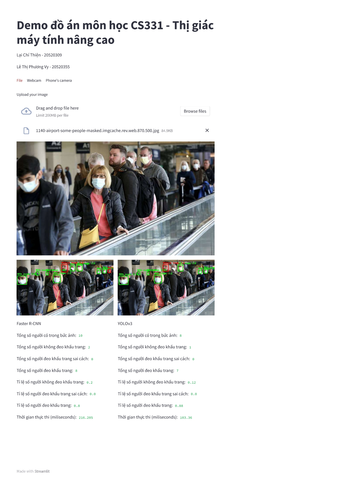

<!-- Title -->
<h1 align="center"><b>Newspaper Crawling with Scrapy</b></h1>

## Set up environment

```
conda env create -f environment.yaml
conda activate demo-mm-st
```

## Streamlit demo

To run streamlit demo, you need to download weights files [Faster-RCNN](https://github.com/laichithien/FaceMaskDetection_StreamlitDemo/releases/download/FaceMaskDetModels/fasterrcnn.pth), [YOLOv3](https://github.com/laichithien/FaceMaskDetection_StreamlitDemo/releases/download/FaceMaskDetModels/yolov3.pth) and place them in `models` folder
After that, simply run command below
```
streamlit run demo.py
```
## Demo interface



